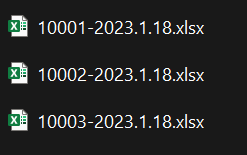
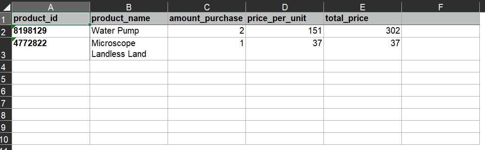
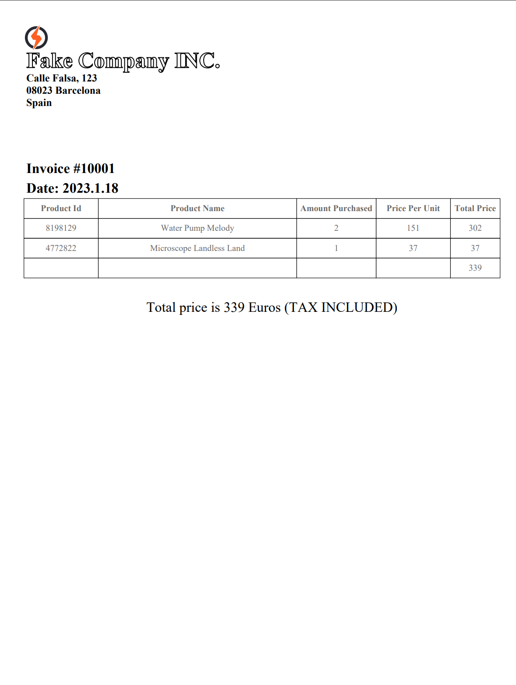

# :uk: What is this project?
### This is an app that creates PDF invoices out of Excel files.

Libraries and packages used in this project:
- FPDF2
- glob
- pathlib
- Pandas

-----------------------

The target of this project is generate an invoice pdf of each Excel file given in a folder (invoices/).

We use the name of the file to extract from it the invoice number and date of the invoice.

We parse the excel files one by one to generate a table with the table of items with prices and quantities and do the 
total sum.

In the output folder (PDFs/) we generate pdf file for each excel file like bellow:

:es: